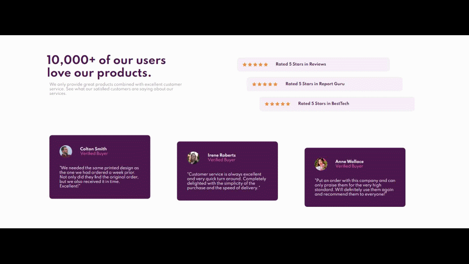

# [Frontend Mentor - Social proof section solution.](https://www.frontendmentor.io/challenges/social-proof-section-6e0qTv_bA "challenge link")
>

<h2 align="center">🔴<a href="https://momenkamal221.github.io/social-proof-section-master/">Live</a>&emsp;&emsp;☕<a href="https://github.com/momenkamal221/social-proof-section-master">solution</a>&emsp;&emsp;😃<a href="https://www.frontendmentor.io/solutions/social-proof-section-solution-momen-kamal-3b4ZXldJA">Post feedback</a></h2>

## Table of contents
- [Table of contents](#table-of-contents)
- [Overview](#overview)
- [Links](#links)
- [Built with](#built-with)
- [What I learned](#what-i-learned)

## Overview

- a responsive design Social proof section

## Built with

- Flexbox
- CSS grids

## What I learned

- building responsive webpage
- building grid layouts

## my latest challenges
If you did not give me feedback on one of my latest challenges, please feel free to give feedback 🙏, I will be glad to see it ❤.  
- [NFT preview card component](https://www.frontendmentor.io/solutions/nftpreviewcardcomponentmain-zklypwzp2){:target="_blank"}  
- [Profile card component](https://www.frontendmentor.io/solutions/profile-card-component-rS34eclxk){:target="_blank"}
